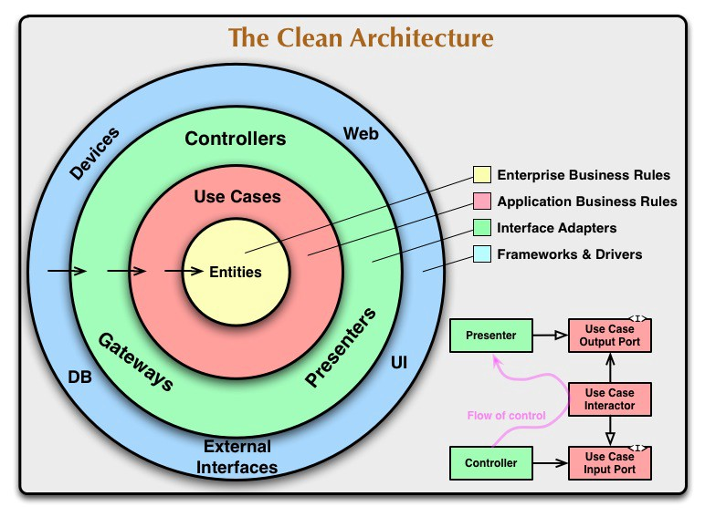
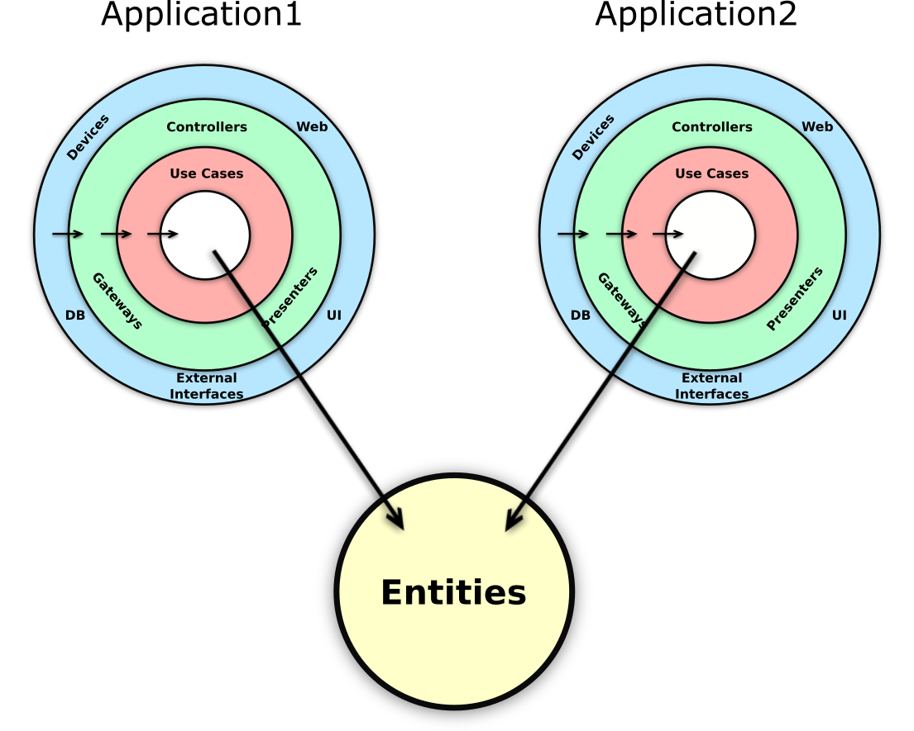

  

# Новости с *JFront*-а (выпуск 2)

## Введение в Чистую Архитектуру

Этот выпуск посвящён подходу к созданию программных продуктов, который планируется использовать на проекте *JFront*.  
Сам подход, широко известный под названием *Чистая Архитектура*, применим к разработке абсолютно любого программного
обеспечения. Поэтому всё, о чём ниже будет сказано, относится не только к *JFront* и даже не только к frontend-продуктам.

## О важном критерии качества

Существует большое количество правильных и весьма важных критериев качества программного обеспечения, таких как
быстродействие, масштабируемость, удобство использования, стоимость разработки, стоимость сопровождения и т.п.  

Но если понаблюдать за ходом разработки программных продуктов, жизнь которых продолжается хотя бы несколько лет (для
корпоративного ПО это обычное дело), то можно заметить, что чем дольше продукт существует, тем более важным из его свойств
становится сохранение у него **способности к развитию**.  

В данном случае речь идёт о способности к такому развитию продукта, которое не приводит к существенному удорожанию его
разработки и которое, в частности, обеспечивает возможность недорогой замены используемых функциональных компонент. 

Для некоторых проектов это свойство иногда оказывается даже не просто важным, а наиважнейшим - в тех случаях, когда дело
доходит до того, что стоимость доработок на проекте начинает определять его жизнеспособность.

Дальнейшее изложение начнём с попытки ответов на три извечных русских вопроса.   

## Что происходит

Практика показывает, что способность продукта к развитию не так часто появляется среди приоритетов начальных этапов
разработки, как она того требует.

Но дело в том, что это свойство является фундаментальным, его нельзя добавить потом, "в рабочем порядке", включив в план
очередных доработок. На последующих этапах думать об этом уже поздно.
  
Обычно всё происходит по банальному сценарию, при котором продукт, как водится, бывает нужен бизнесу "ещё вчера", когда
первая версия - (де-факто - MVP-версия) продукта - вместо того, чтобы быть сразу переделанной с должным качеством в
рассчёте на долгую жизнь, быстро уходит в production, после чего бизнес начинает требовать от разработчиков немедленного
"продолжения банкета".    
При этом первое время новые функции добавляются легко и быстро. Все довольны. 

Но это тот сценарий, когда продукт изначально рождается с врождённым и практически невозвратным техническим долгом,
когда, если не произойдёт чего-то из ряда вон выходящего типа полного переписывания, продукт после "сбора первого урожая"
обречён сначала на довольно скорую стагнацию, а затем на медленную (иногда бывает - мучительную) смерть.  

## Кто виноват

В этом вопросе невозможно всю вину возложить на кого-то одного. И "бизнес", и "разработка" - все несут ответственность,
причём каждый - свою.
 
Вина "бизнеса" обычно состоит в отсутствии понимания или игнорирования того факта, что стоимости развития продукта очень
сильно зависит от архитектурных решений и размера технического долга, а также в поверхностном подходе к выбору
исполнителей, что, в частности, проявляется в ориентации только на стоимость начальных этапов разработки и в
игнорировании значимости архитектурных решений, предлагаемых теми ли другими разработчиками.
   
Вина "разработки" чаще всего состоит в отсутствии опыта, достаточного для построения архитектур, готовых к долгому
развитию. 

При этом и те, и другие, к сожалению, нередко придерживаются политики "после нас хоть потоп", при которой главным
приоритетом де-факто становится внедрение продукта, за которым следует получение соответствующих "поощрительных призов",
после чего последующие проблемы развития продукта, как правило, приходится решать уже кому-то другому.   

## Что делать

О возможности развития продукта в долгосрочном периоде нужно заботиться с самого начала.

Если такой опыт есть, понятно, что его нужно применять.

Но если такого опыта нет, что бывает чаще всего, то его нужно получать и нарабатывать. Разумеется, только практикой,
другого пути нет.
 
Понятно, что, все эти слова выглядят банальными благими пожеланиями.  
Но, к сожалению, намного реже, чем этого хотелось бы, они находят своё практическое воплощение, и поэтому продолжают
сохранять актуальность. 

### Главный приоритет проекта

Главным приоритетом подхода, предлагаемого на проекте *JFront* является **создание продукта, устойчивого к изменениям и
готового к долгому развитию**.  

И конечно, в данном случае речь идёт не просто о готовности к тактическим изменениям типа лёгкого рефакторинга имён,
файловой структуры, каких-то оптимизаций, а о гораздо более серьёзных вещах, таких как замена используемых API,
библиотек, а если потребуется, то и фреймворков.

#### О [пока ещё] традиционных подходах

Тут у многих может возникнуть вопрос, а что останется от продукта, если, например, заменить фреймворк, на котором этот
продукт сделан ?

Здесь уже сами по себе эти слова - "продукт сделан на фреймворке" - говорят о многом.

В том-то и дело, что при сегодняшних пока ещё традиционных фреймворк-центричных подходах при замене фреймворка от
продукта не останется ничего, то есть замена фреймворка будет фактически означать переписывание продукта с нуля.

Всё дело в том, что на самом деле при использовании этих самых фреймворк-центричных подходов сущностный код продукта - 
код его бизнес-логики - так незаметно перемешивается с кодом фреймворка, что приводит к ощущению их абсолютной
неразделимости.

О том, что на самом деле это не так, можно узнать, изучив подход, используемый в [*Чистой 
Архитектуре*](https://blog.cleancoder.com/uncle-bob/2012/08/13/the-clean-architecture.html) [Роберта
Мартина](https://en.wikipedia.org/wiki/Robert_C._Martin). И гораздо лучше сделать это, применив его на практике.

## Чистая архитектура

*Чистая Архитектура* по Роберту Мартину подразумевает следование принципам **SOLID**, автором которых, к слову сказать,
он же и является, и которые он последовательно раскрывает в своей теперь уже [знаменитой
книге](https://www.amazon.co.uk/Clean-Architecture-Craftsmans-Software-Structure/dp/0134494164).

### Язык *Чистой Архитектуры*
*Чистая архитектура* имеет свой язык и свой терминологический словарь. Не потому, что она оперирует какими-то совершенно
новыми терминами и понятиями (хотя в некоторой степени и это присутствует), сколько в том, что часть этих терминов в её
контексте приобретает некоторый дополнительный, а иногда и особенный смысл.  

Прекрасный понятийный, в чём-то - критический, анализ терминологии *Чистой Архитектуры* сделан в статье [Заблуждения
Clean Architecture](https://habr.com/ru/company/mobileup/blog/335382/). 

#### Краткий терминологический словарь
Ниже представлен краткий словарь терминов, используемых в различных текстах и программных решениях, относящихся к
*Чистой Архитектуре*:

- *Entities* - "бизнес-правила, независимые от приложения" (не обязательно буквально "Сущности")
- *Use Cases* - *Сценарии* - описания действий, которые могут совершать пользователи системы
- *Interactor* – *Интерактор* - программная реализация *Use Case*
- *Domain* - *Предметная область* - объединяет *Сущности* и *Сценарии*, представлена *бизнес-правилами* системы, является
самой стабильной, сущностной составляющей любого программного продукта 
- *Repository* - компонент, поддерживающий метафору коллекции, обеспечивающий доступ к объектам определённого типа
- *Gateway* - часто используется в качестве синонима *Repository*, но может иметь (и часто имеет) более широкий смысл -
фасад, представляющий некий сервис, не обязательно связанный с хранением данных 
- *Controller* - по сути - адаптер UI-фреймворка для *Интерактора*, отвечающий за реакцию на действия пользователя
- *Presenter* - по сути - адаптер UI-фреймворка для *Интерактора*, отвечающий за функции отображения бизнес-объектов.
Иногда берёт на себя роль *Контроллера*, совмещая ответственность вывода и реакции на действия пользователя.
- *Инфраструктура* - всё, что находится за пределами слоя *Domain* и что по отношению к нему является вторичным. 

  
   
  <b>Оригинальная схема, иллюстрирующая идеи Чистой Архитектуры</b>

### Правило зависимостей

Как уже говорилось, в книге *Чистая Архитектура*  последовательно раскрываются принципы *SOLID*.  
Но многое, в том числе, главная диаграмма *Чистой Архитектуры*, говорит о том, что центральное место в ней занимает так
называемое **правило зависимостей**, согласно которому все зависимости системы должны быть направлены от второстепенных
деталей - к главным, сущностным - см. на горизонтальные стрелки на рисунке, направленные от периферии к центру.   

Среди принципов *SOLID* на это правило указывает последняя буква аббревиатуры - **D**, обозначающая шаблон
проектирования ***Dependency Inversion*** (не путать с другим *DI* - *Dependency Injection*), который фактически
является главным шаблоном проектирования (если брать ООП), поскольку *правило зависимостей* реализуется именно с его
помощью.

Следование *правилу зависимостей* как раз и обеспечивает системе живучесть и способность к долгому развитию, которое
необходимо любому серьёзному программному продукту.

Глубинная суть правила зависимостей очень проста, она состоит в следующем: **более значимые свойства системы не должны
зависеть от менее значимых**.    

При этом соотношения значимости свойств в каждой конкретной системе свои, и в первую очередь, разумеется, эти
соотношения должны отвечать задачам, которую эта система решает.

Правило зависимостей заставляет разработчика с самого начала думать о важных вещах: о том, где и как провести границу
между сущностями предметной области и сценариями бизнес-логики, между бизнес-логикой продукта и остальной так называемой
*инфраструктурой*, которая как раз и состоит из библиотек, фреймворков и баз данных.

### Слои повторного использования

На самом деле и сущности, и сценарии являются, хотя и типовыми, но всё-таки лишь частностями, которые используются в
качестве иллюстрации применения принципов Чистой Архитектуры.

Например, Мартин говорит, что *Entities* в одном случае можно считать "корпоративными бизнес-правилами", в другом, "если
у вас нет корпорации", они могут быть бизнес-объектами приложения.  

Но самый главный смысл, который несут слои диаграммы, заключается в том, что они являются по сути *слоями повторного
использования*, где внутренние слои используются внешними.   
То, что будет составлять содержание этих слоёв, является частным вопросом конкретной системы.
Но принципиально важно, чтобы зависимости всегда были направлены от внешних - менее стабильных слоёв - к более
стабильным внутренним.  

  
  
<b>Использование сущностей разными приложениями</b>

На этом рисунке показано, как корпоративные сущности (такой сущностью, например, может быть широко употребимый класс
*Customer*) используются несколькими (здесь - двумя) приложениями. Правило зависимостей в данном случае позволяет как
угодно менять состав таких приложений, создавая новые приложения или прекращая поддержку старых, но при этом никак не
затрагивая код самих сущностей.  

Этот же принцип остаётся применимым для любой пары смежных слоёв, позволяя объектам внешнего слоя повторно использовать
объекты внутреннего.

Таким образом *Правило зависимостей* придаёт системе устойчивость к изменениям в долгосрочном периоде.

Следующий выпуск планируется посвятить подробному рассказу о *Dependency Inversion*, который, как уже было сказано,
фактически является главным шаблоном проектирования *Чистой Архитектуры*.

## Используемые материалы

1. [The Clean Architecture](https://blog.cleancoder.com/uncle-bob/2012/08/13/the-clean-architecture.html)
2. [Mihaly Nagy - Thoughts on Clean Architecture](https://android.jlelse.eu/thoughts-on-clean-architecture-b8449d9d02df)
3. [Заблуждения Clean Architecture](https://habr.com/ru/company/mobileup/blog/335382/)
4. [Чистая архитектура. Искусство разработки программного обеспечения](https://www.litres.ru/robert-s-martin/chistaya-arhitektura-iskusstvo-razrabotki-program-39113892/)
