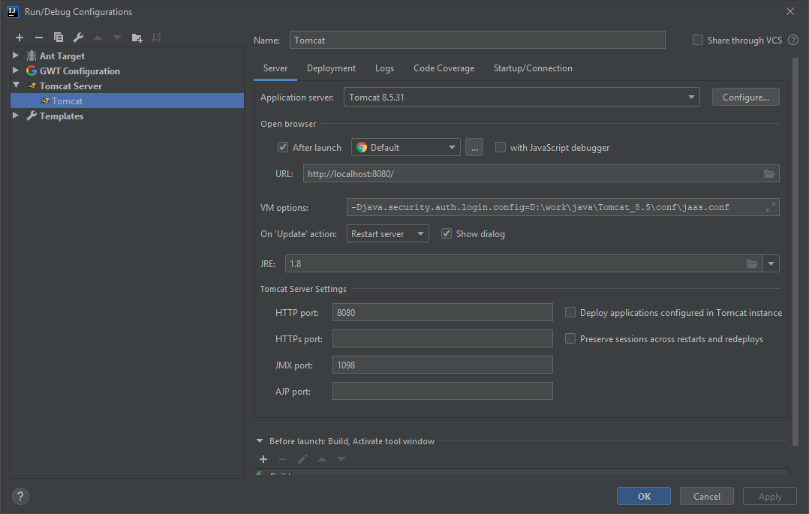
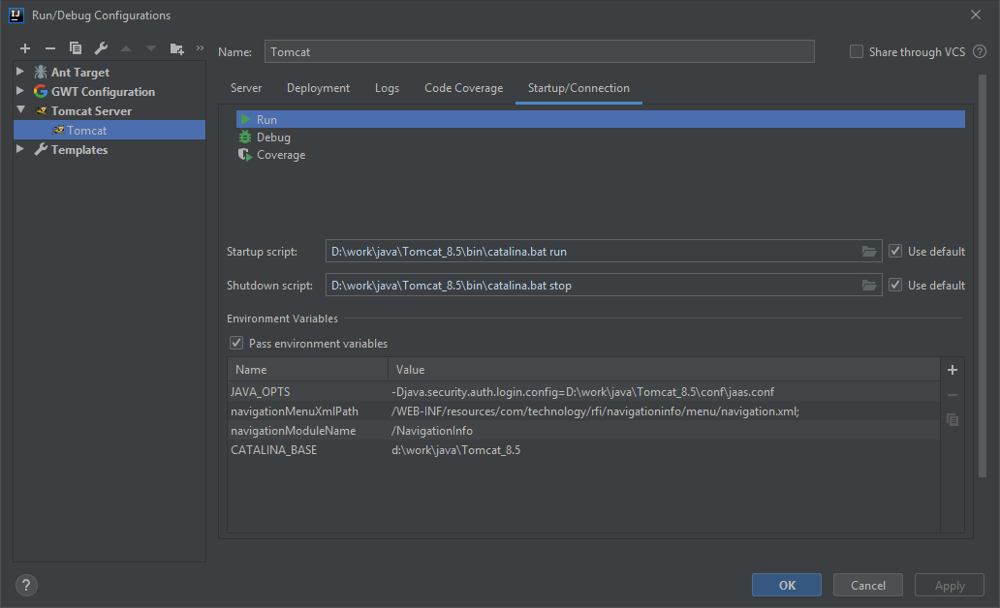
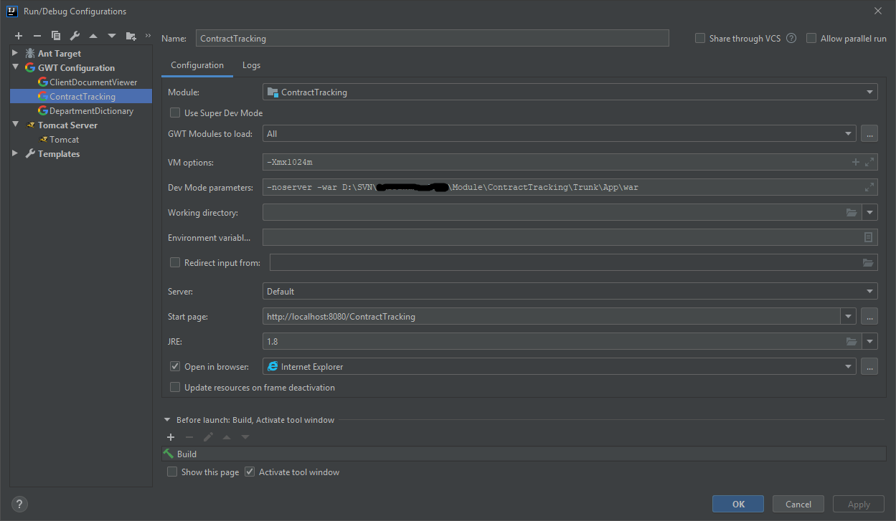
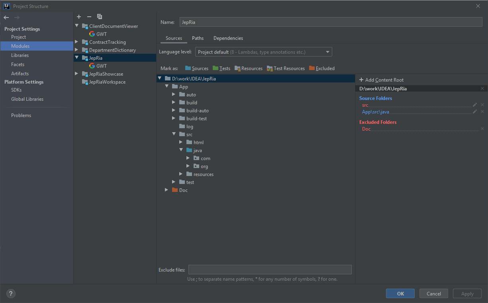
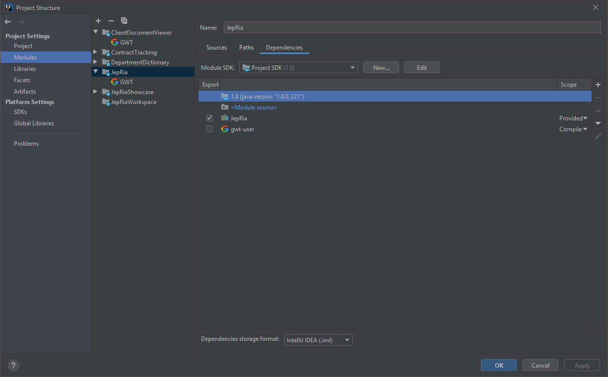
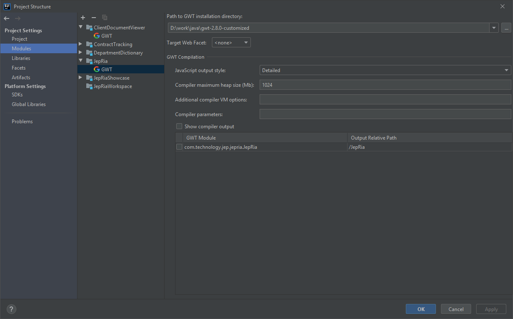
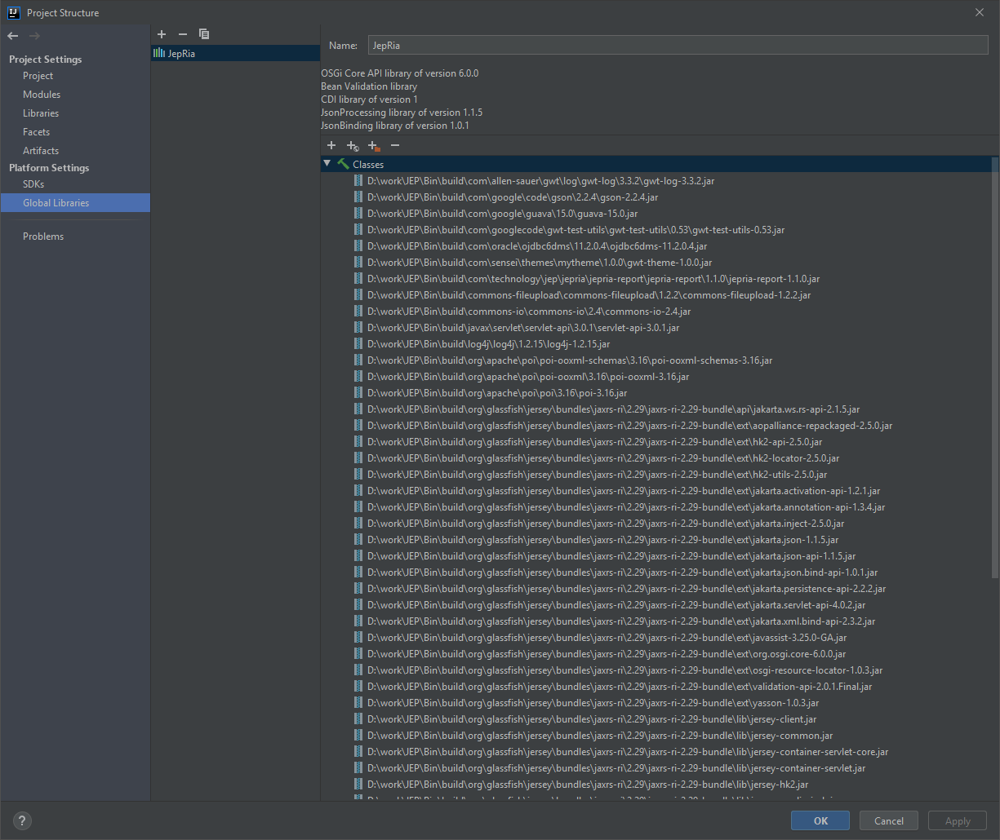
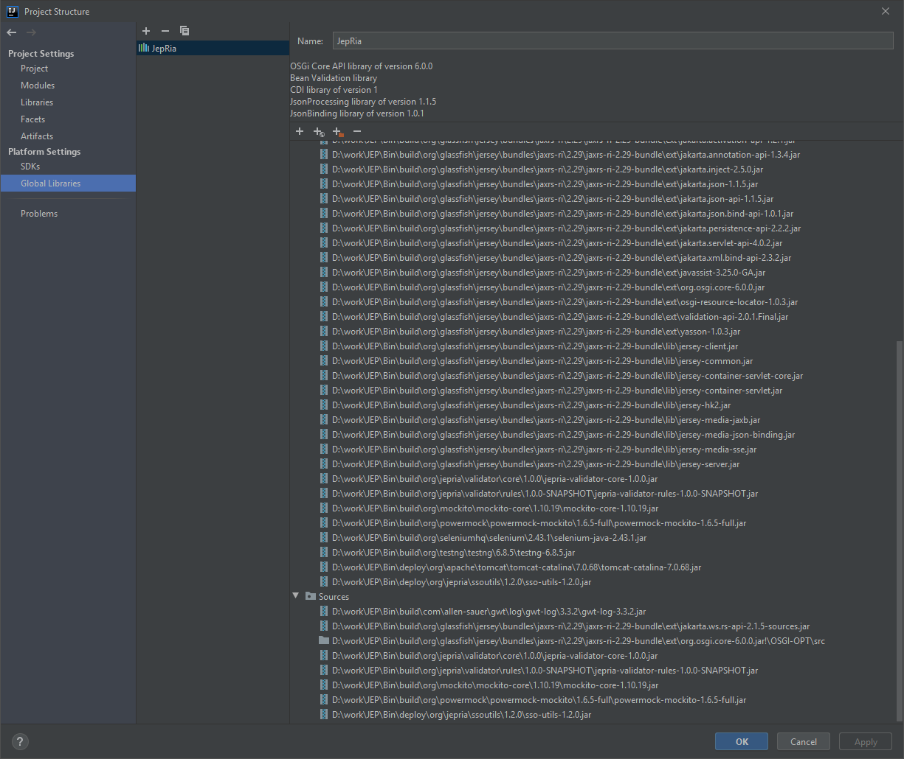
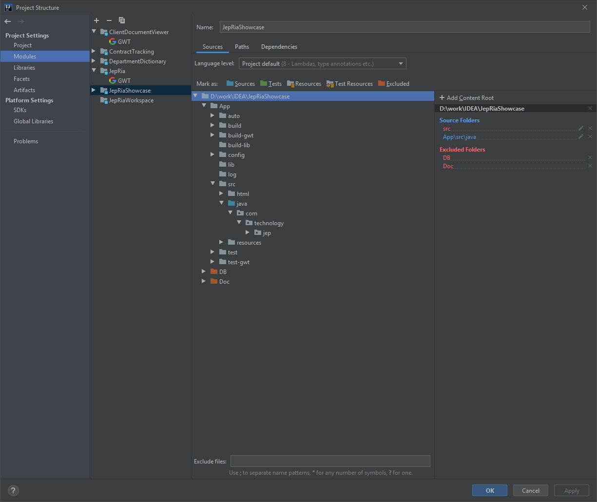

# Настройка IntelliJ IDEA.

## Серверный Debug.

<p align="center">
   <div">
   
   </div>
</p>

```
-Djava.security.auth.login.config=D:\work\java\Tomcat_8.5\conf\jaas.conf
```

<p align="center">
   <div">
   
   </div>
</p>

```
navigationMenuXmlPath=/WEB-INF/resources/com/technology/rfi/navigationinfo/menu/navigation.xml
navigationModuleName=/NavigationInfo
CATALINA_BASE=d:\work\java\Tomcat_8.5
```

## Клиентский Debug.

<p align="center">
   <div">
   
   </div>
</p>

## Настройка зависимостей JepRia.

<p align="center">
   <div">
   
   </div>
</p>

<p align="center">
   <div">
   
   </div>
</p>

<p align="center">
   <div">
   
   </div>
</p>

<p align="center">
   <div">
   
   </div>
</p>

<p align="center">
   <div">
   
   </div>
</p>

<p align="center">
   <div">
   
   </div>
</p>
